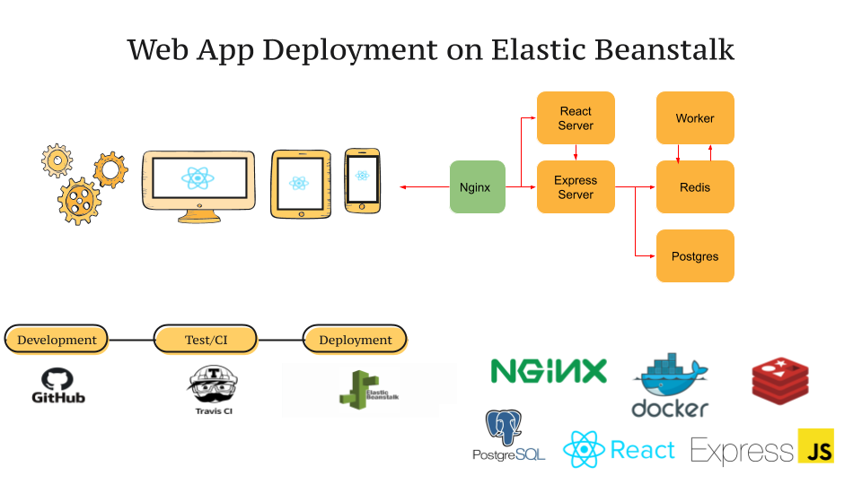

## Web Application Development and Deployment to Elastic Beanstalk

  

This project attempts to build a multi-container web and pipeline to test and deploy it. Nginx is used as a web server, React is used as a frontend server, express is used as a backend server to route requests to redis, postgres, and a worker node that runs a mathematical function. 

Project flow:
1. Develop the application and push the code to github
2. Github triggers Travis CI
3. Travis CI automatically pulls the repo
4. Travis CI builds a test image and test the code
5. If Travis gets a green build, then it destroys the test image and move to the next action
6. Travis builds production images
7. Travis pushes the production images to Docker hub
8. Then, Travis sends a message to AWS Elastic Beanstalk that it can pull the images from Docker hub
9. Finally, AWS EBS pulls images from Docker hub and deploys them 